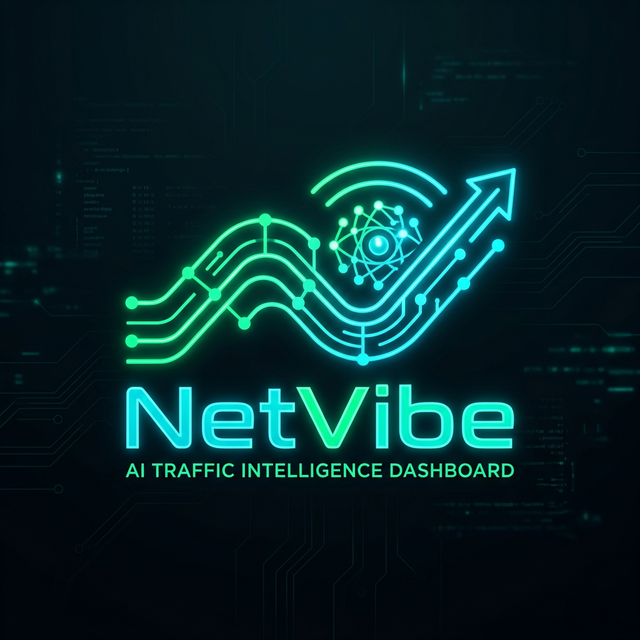

<div align="center">
  

  # 🛡️ NetVibe | AI Traffic Intelligence Dashboard

  [](https://www.python.org/)
  [](https://fastapi.tiangolo.com/)
  [](LICENSE)

  <p align="center">
    A <strong>premium real-time AI traffic monitoring suite</strong>. Detects, classifies, and visualizes AI-bound network traffic across your infrastructure with sub-second latency.
  </p>

  <br />

  

  <br />

</div>

---

## 📺 Live Demo
Don't have root access right now? No problem. NetVibe includes a fully functional **Simulated Demo Mode** that allows you to explore the dashboard features without live packet capture.

```bash
# Start NetVibe in Demo Mode
netvibe --demo
```

---

## ✨ Premium Features

### 🖥️ Next-Gen Cybersecurity UI
- **Glassmorphism Design**: High-end translucent panels with neon cyan and emerald accents.
- **Dynamic Adaptivity**: Fully responsive layout optimized for 4K and mobile monitoring.
- **Neural Intel Feed**: Real-time scrolling packet log with device iconography.

### 📡 Real-Time Intelligence
- **Live WebSocket Streaming**: Experience sub-millisecond updates without refreshing.
- **AI Service Detection**: Automatically identifies traffic to OpenAI, Gemini, Claude, and more.
- **JA4 Fingerprinting**: Identifies encrypted traffic patterns even when SNI is hidden.

### 📱 Device Classification
NetVibe uses deep packet inspection and MDNS to classify every device on your network:
- **Laptop / Mobile / IoT / Server / Smart TV**
- **Manufacturer Identification** via OUI lookup.

---

## 🚀 One-Command Installation

NetVibe features a **fully automated setup wizard** that handles environment creation, dependency installation, and driver detection with a single command.

### ⚡ Quick Start
Open your terminal/command prompt in the `netvibe` directory and run:

**macOS / Linux:**
```bash
./setup.sh
```

**Windows (Admin):**
```bat
setup.bat
```

> [!TIP]
> **Zero Configuration**: The setup will automatically detect your OS, install all Python requirements, and prompt you to install `netvibe` globally. You only need to choose **Yes/No** when prompted.

---

## 🛠️ Installation Details

### 1. Automated Setup Process
When you run the setup command, NetVibe performs the following:
- **Environment Isolation**: Creates a dedicated Python virtual environment (`env/`).
- **Core Dependencies**: Installs the high-performance traffic monitoring suite.
- **Driver Detection**: 
  - **Windows**: Automatically detects if `Npcap` is missing, downloads the installer, and launches it for you.
  - **macOS/Linux**: Verifies `libpcap` compatibility.
- **Global Path Integration**: Optionally adds `netvibe` to your system path (User input: **Yes/No**).

### 2. Manual Prerequisite Check
If the automated driver setup fails, ensure you have the following packet capture drivers:

| Platform | Recommended Driver | Installation Command |
| :--- | :--- | :--- |
| **macOS** | `libpcap` | `brew install libpcap` |
| **Windows** | `Npcap` | [Download Npcap](https://npcap.com/#download) |
| **Ubuntu / Debian** | `libpcap-dev` | `sudo apt update && sudo apt install libpcap-dev` |
| **Fedora / RHEL** | `libpcap-devel` | `sudo dnf install libpcap-devel` |

---

## 🚦 Launching NetVibe

After setup, you can launch the Intelligence Dashboard from any directory (if you opted for global installation):

```bash
# Start Live Monitoring (Requires Elevation)
sudo netvibe

# Start in Demo Mode (No Root Required)
netvibe --demo
```

> **Note for Windows**: Always run your Command Prompt or PowerShell as **Administrator** for live packet capture.

---

## 🗂️ Project Architecture

```
netvibe/
├── src/netvibe/
│   ├── fastapi_app.py     # Backend & API
│   ├── sniffer.py         # Scapy Engine
│   ├── database.py        # SQLite Persistence
│   ├── cli.py             # CLI Entry Point
│   └── templates/         # Dashboard UI
├── docs/assets/           # Visual Assets
├── setup.sh               # Unix Installer
└── setup.bat              # Windows Installer
```

---

## 🔌 Developer API

| Route | Method | Description |
| :--- | :--- | :--- |
| `/api/stats` | `GET` | Overall dashboard metrics |
| `/api/logs` | `GET` | Historical alert logs |
| `/api/agents` | `GET/POST` | AI Agent Management |
| `/ws` | `WS` | Real-time traffic stream |

---

## ⚖️ Disclaimer
NetVibe is for educational and authorized administrative use only. Monitor only networks you own or have explicit permission to audit. The developers are not responsible for any misuse.

---

<div align="center">
  Built with ❤️ for the AI Community.
</div>